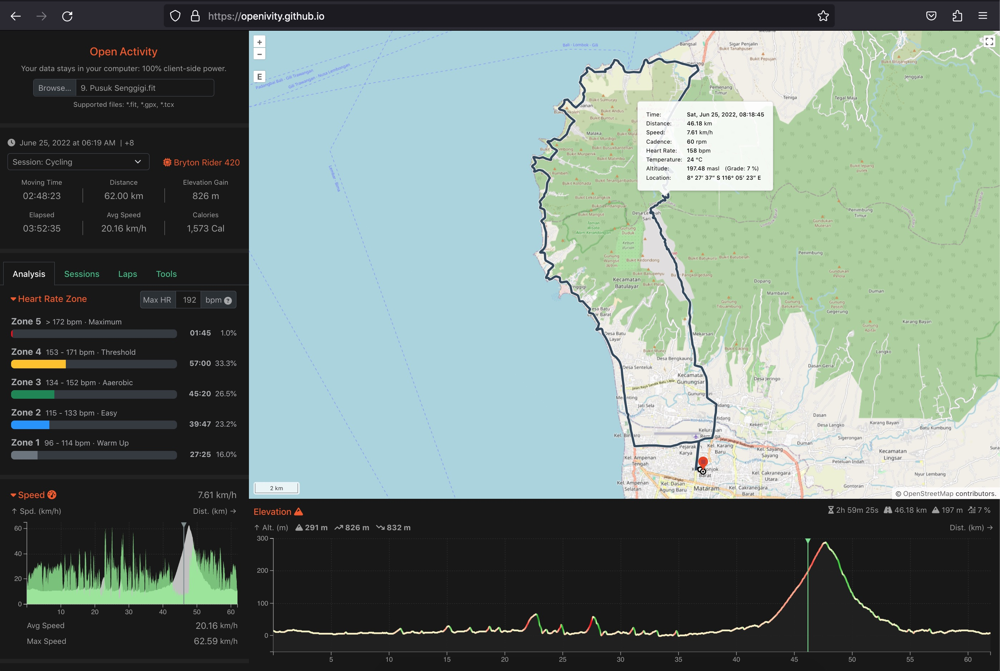

    

        
    

    

Open Activity, also known as Openivity, is a free and open-source fitness analytic platform offering seamless integration with OpenStreetMap. Effortlessly visualize, edit, convert, and combine multiple FIT, GPX, and TCX activity files. Enjoy the full power of client-side processing for first-class privacy. Try right away at [https://openivity.github.io](https://openivity.github.io).

### Crafted with ❤️; made possible by:

- [Go](https://go.dev) - [WebAssembly](https://github.com/golang/go/wiki/WebAssembly)
- [FIT SDK for Go](https://github.com/muktihari/fit)
- [XML Tokenizer](https://github.com/muktihari/xmltokenizer)
- [Node.js](https://nodejs.org) - [Vite](https://vitejs.dev) - [Vue](https://vuejs.org) - [Typescript](https://www.typescriptlang.org)
- [Bootstrap](https://getbootstrap.com)
- [OpenLayers](https://openlayers.org)
- [OpenStreetMap](https://www.openstreetmap.org)
- [D3.js](https://d3js.org)

## Getting Started

Please refer to the [development environment setup](docs/CONTRIBUTING.md#development-environment-setup) instructions if you wish to run it locally on your local machine.

## Features

- Supported files: **\*.fit**, **\*.gpx**, and **\*.tcx**
- Support for opening single or multiple files
- Support for multiple sport session in single or multiple files
- Activities Summary
- Map Viewer (powered by OpenStreetMap)
- Graphs:
  - Elevation
  - Heart Rate Zone
  - Splits Pace
  - Pace
  - Speed
  - Cadence
  - Heart Rate
  - Power
  - Temperature
- Laps & Sessions Summary
- Tools
  - Export to FIT, GPX, or TCX
  - Edit Relevant Data
    - Change Sport Type
    - Change Device
    - Trim Trackpoints
    - Conceal GPS Positions
    - Remove Fields: Cadence, Heart Rate, Power, and Temperature
  - Combine multiple activities into one continuous activity.
  - Split activity per session

## Roadmap

See the [open issues](https://github.com/openivity/openivity.github.io/issues) for a list of proposed features (and known issues).

## Support

If you have any questions or encounter any issues, feel free to open an [issue](https://github.com/openivity/openivity.github.io/issues/new) and we will assist you in resolving them.

## Project assistance

If you want to say **thank you** or/and support active development of Open Activity:

- Add a [GitHub Star](https://github.com/openivity/openivity.github.io) to the project.
- Tweet about the Open Activity.
- Write interesting articles about the project on [Dev.to](https://dev.to/), [Medium](https://medium.com/) or your personal blog.

## Contributing

First off, thanks for taking the time to contribute! Contributions are what make the open-source community such an amazing place to learn, inspire, and create. Any contributions you make will benefit everybody else and are **greatly appreciated**.

Please read [our contribution guidelines](docs/CONTRIBUTING.md), and thank you for being involved!

For a full list of all authors and contributors, see [the contributors page](https://github.com/openivity/openivity.github.io/contributors).
