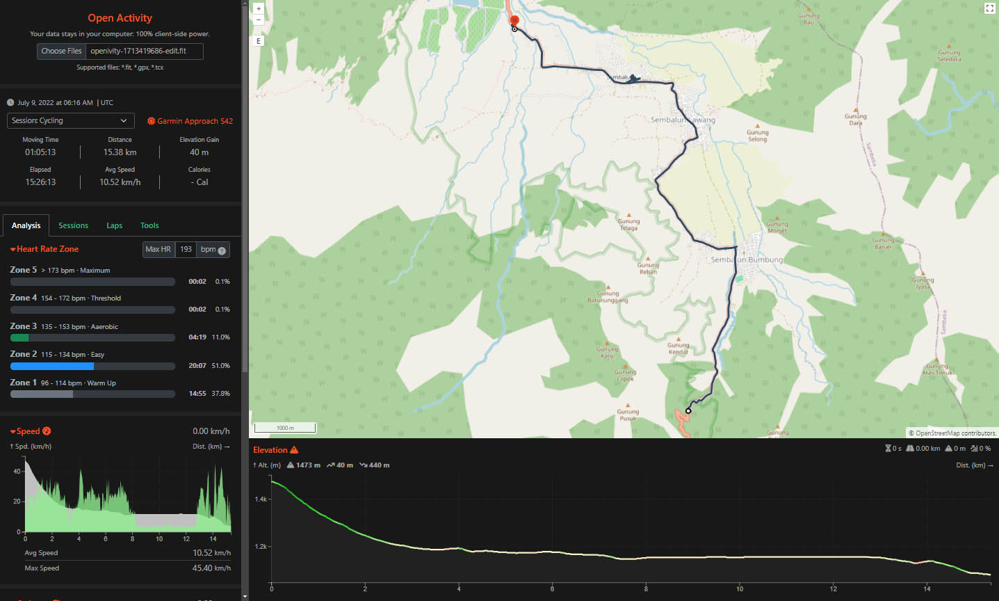

<h1 align="center">
  
</h1>

 

Table of Contents

- [About](#about)
- [Getting Started](#getting-started)
- [Features](#features)
- [Roadmap](#roadmap)
- [Support](#support)
- [Project assistance](#project-assistance)
- [Contributing](#contributing)
- [Contributors](#contributors)
- [Security](#security)
- [License](#license)

---

## About

Interactive tool to view (with OpenStreetMap view), edit, convert and combine multiple FIT, GPX and TCX activity files. 100% client-site power!

### Built With

- Go - WASM
- NodeJS Vite - Vue - Typescript
- Open Layer
- Open Street Map
- Bootstrap
- d3.js

## Getting Started

Please see [Development environment setup](docs/CONTRIBUTING.md#development-environment-setup) to set-up.

## Features

- Supported files: \*.fit, \*.gpx, \*.tcx
- Support open Single or Multiple files
- Support multiple sport session in Single or Multiple files
- Map view
- Heart Rate Zone
- Speed Graph, Cadence Graph, Heart Rate Graph, Elevation Graph
- Laps & Session
- **Tools**
  - Export to fit, gpx, tcx
  - Edit Relevant Data
    - Change Sport Type
    - Change Device
    - Trim Track
    - Conceal GPS Positions
    - Removes Cadence, Heart Rate, Power, Temperature
  - Combine Multiple Activities
  - Split Activity per Session

## Roadmap

See the [open issues](https://github.com/openivity/openivity.github.io/issues) for a list of proposed features (and known issues).

## Support

Reach out to the maintainer at one of the following places:

- [GitHub issues](https://github.com/openivity/openivity.github.io/issues/new?assignees=&labels=question&template=04_SUPPORT_QUESTION.md&title=support%3A+)
- Contact options listed on [this GitHub profile](https://github.com/openivity)

## Project assistance

If you want to say **thank you** or/and support active development of Open Activity:

- Add a [GitHub Star](https://github.com/openivity/openivity.github.io) to the project.
- Tweet about the Open Activity.
- Write interesting articles about the project on [Dev.to](https://dev.to/), [Medium](https://medium.com/) or your personal blog.

## Contributing

First off, thanks for taking the time to contribute! Contributions are what make the open-source community such an amazing place to learn, inspire, and create. Any contributions you make will benefit everybody else and are **greatly appreciated**.

Please read [our contribution guidelines](docs/CONTRIBUTING.md), and thank you for being involved!

## Contributors

The original setup of this repository is by [Openivity](https://github.com/openivity).

For a full list of all authors and contributors, see [the contributors page](https://github.com/openivity/openivity.github.io/contributors).

## Security

Openivity - Open Activity follows good practices of security, since it's used in 100% client-site, it consider as safe, but 100% security cannot be assured.

Openivity - Open Activity is provided **"as is"** without any **warranty**. Use at your own risk.

## License

This project is licensed under the **GPL 3**.

See [LICENSE](LICENSE) for more information.
